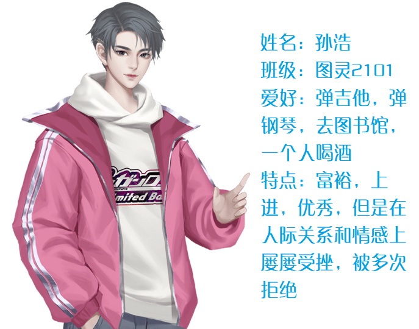

## 第一章：疑团初起

> 小镇上，似乎多了些不一样的人。)

2021年8月，一个自称是21级图灵班的“孙浩”同学，添加了我的一个学妹，并且说希望和她认识，同时给她发了好多消息。而他的QQ空间和语气，明显不像是一个正常的刚上大学的同学：他空间三天可见，但是却发了不少不露脸的弹吉他，住高档酒店，秀肌肉的图，聊天语气也是很不正常，跟真正的新生有肉眼可见的区别。
于是我和学妹核对了21级图灵班同学的名单，发现并没有叫做“孙浩”的人。很显然，他并不是真正的21级图灵班同学。然而此时有一个更为明显的忧虑，“孙浩”和学妹之间没有任何联系但是却能去添加她，那么他一定会这样骚扰更多的同学，或许真的有我们身边的朋友就因此而受害。本来我们打算在群里公开他，让大家防范，但是这样首先学妹会暴露，可能会引起“孙浩”的纠缠，其次我们也难以在不公开聊天记录的情况下让更多的人知道这件事情。何况从聊天来看，“孙浩”对我们学校非常了解，连西区食堂在哪都知道，根本无法排除那个“孙浩”其实就在我们身边的可能性，看98朵朵多的同学也知道浙大的学生里面出渣男也不是一个两个了。于是经过敏锐而细致的构思，我们设下了一个局。
## 第二章：驱虎吞狼

>驱虎吞狼，保我无虞。

只需要让同学和学弟学妹们知道，新生群里的人并不一定是真正的同学（学妹对过名单，有三四个都查不到名字），那么他们对这些人的甜言蜜语，也就不容易上钩了。但是“孙浩”们又不会主动暴露，那怎么才能达到这个目的呢？那就是得有一个假同学要暴露，那为什么不我们来当这个假同学呢？
于是用了我们在部门“国王与天使”游戏当中的小号，虚构了一个身份——21级 图灵班 梁娜娜同学，并伪装了相应的身份，构造了对应的QQ空间。果然很快“梁娜娜”就加入了群聊。“梁娜娜”积极水群，很快就吸引到了大家的注意，学妹又在同学当中恰如其分的宣传新生的团员信息录入，很快，同学们就发现名单当中，包括“梁娜娜”在内的四个非本班同学，并将其清了出去。
这一波，基本上整个竺院都知道了有人假冒真正的同学，学长组学会了查名单之后，“孙浩”也难有藏身之地了。
在此致谢图灵班刘仁杰，巴德年班段藤新一，混合班郭尔摩斯，还有一系列同学和群友的倾情相助。
## 第三章：愿者上钩

>究竟是布下陷阱的人，还是被布下陷阱的人呢

更欣喜的是，“孙浩”主动提出来认识“梁娜娜”。“梁娜娜”正求之不得，当然答应了。
我们开始了下一步的计划：
如果”孙浩“能够认出“梁娜娜”是虚构不存在的人，那么“孙浩”一定是竺院内部的人，进一步缩小可能的范围。
如果“孙浩”不能够认出“梁娜娜”，那么“梁娜娜”就可以假装上钩，从而套出更多“孙浩”的信息。
学妹告诉了我一个致命的这个组合的优点：她在紫金港，可以来提供紫金港的照片，那样更可以增加真实性。于是，这个陷阱就开始了。配合无间，真是一出好计策。

 

<size=40%>图1 孙浩和梁娜娜的聊天1</size>

随后，“孙浩”和“梁娜娜”之间进行了几度拉扯：
“孙浩”想在“梁娜娜”面前不断表现，意图能够撩到“梁娜娜”。
“梁娜娜”想试图获得“孙浩”的信息，知道“孙浩”的真实身份。
刀光剑影之间，觥筹交错之时，杀机暗藏。
猎杀与反猎杀，机关与陷阱之间，谁能笑到最后？
在拉扯中，两人都彼此构建了对方的人设：

 
 

<size=40%>图2 二人人设</size>

构建人设方面学妹给了我很大的支持。作为女生，当然更知道如何去吸引男生，更何况学妹也算个情场老手。
首先不能太主动，否则会让对方认为太好追，前期发展太迅速后续发展不出来的话会使人生疑。
其次要表现出自己的生活非常的丰满，这样不回消息也可以有理由来解释。
第三要让男生感觉到机会，如果明确不想谈恋爱或者有其他喜欢的人会让男生认为没有机会而放弃。
最后，放长线钓大鱼，对方既然选择了装身份的方式那自己正式条件一定不会太超出常人，如果是185体育生大概没必要用这么繁杂的方式，所以说对方的pua，恰恰说明了对自己的不自信。那么让对方感觉有机会但是又不那么容易拿下，就会套出更多相关的信息和内容。
一出好戏即将上演，一张大网已经拉开。
## 第四章：针锋相对

> 每个人都有他们自己的目的，这也就是人们敌对的理由。

间谍有三个步骤：
第一是由陌生到熟悉，逐步取得信任。
第二是由熟悉到主动，在关系中朝着让自己主动的一方发展。
第三是由主动到探寻，在第二步基础上逐渐达成自己的目的。
那么，现在就是，从熟悉到主动的步骤。前期的铺垫已经让“孙浩”相信了“梁娜娜”是真正的图灵班同学且是一个可以下手的对象，那么就要我们来控制局面了。每天的聊天还需进行，否则就会起疑心。

 

<size=40%>图3 孙浩和梁娜娜的聊天2</size>

这是对话中的一段。
现在是问答环节。1.这段对话里面透露了什么信息？2.这段对话中放了哪些陷阱？请拖动鼠标查看答案。

<color=white>
1.“孙浩”可以进学校，能进入教室（视频），对于学校有所了解（东一b），空闲时间多（对照了课表这一点可以说明很仔细，但是他要应对这么多女生能做到这个程度必须空闲时间不少），对课程等界面没有那么熟悉（存疑，因为没认出那个图是推荐课表）
2.邀请去图灵团建（对方绝对不敢去，这样平白无故多一个放鸽子的事件，也能让对方看到女生的回应），大学英语VI是6，但是根本没有大学英语6，如果他提出质疑则更可能了解学校课程的设置。
</color>

几个月的聊天中间步骤省略。此时，对于“孙浩”的身份，已经有所初步了解：
他是一个能出入学校，对浙大包括竺院、西区很了解，不是20或21级浙大本科生或军训时在连部，没有运动或健身习惯，身高在165-174之内，在1996-2003年间出生，在浙大或浙大周边有居住地，使用iPhone11，在学识层面并不出众，学历在初中以上研究生以下，但是有过文化积累且对文化颇为认可，不是体育生，不是rapper，在安徽和余姚都有过轨迹。不需要体育打卡。
具体分析如下：
首先，他能出入学校。那些他用手机拍到的图片，核对了属性，是iPhone11所拍，和其QQ空间里的网图明显不相同。何况他拍了即时的视频，这更不能作假。拍完视频之后我就给在附近的学妹发了消息并且看了智云课堂，可惜视角不佳没有找到，大概是拍完视频马上走了。
其次，他对学校有一定了解。他说西区是荒郊野岭，楼下有超市，住在7幢，这些都得是真正有过接触的人才能知道的，所以说就算他不住在学校，也对于学校的地理条件等也得比较了解。
不是20或21级本科生或其军训时在连部，很简单，他在训练的时候发了消息。
没有运动或健身习惯，身高在165-174之内：如果有运动或健身习惯他一定会主动说。他没有说180甚至175也没有说，显然身高低于这个值；大于165是因为他多次提出面基。
在1996-2003年间出生：其实挺宽泛的了。当时是18-25岁，他的空闲时间很多一定不是上班的，聊天手法和语气略显年轻很像刚毕业的高中或中专学生，放大到25是考虑到有一些受到打击而宅在家的失业青年的情况，这种人也没有那么多社会气。
在浙大或浙大周边有居住地，因为能这么多天都离浙大很近，所以有浙大邻近的居住地，甚至可能就在校内。
喜好高消费是因为他频繁说“高价咖啡”，QQ空间也是”豪华酒店“之类。这一点在正文稿删了，因为没有确实的证据。
学识方面并不出众因为他在吹嘘，如果是真的出众明显不用吹嘘。
学历在初中以上研究生以下，因为他说的内容还是跟大学学习有关，如果是初中及以下很难了解这些，如果在研究生，应该聊的更多也在科研，所以说学历在初中到研究生之间。
有过文化积累对文化非常认可，因为他在装学霸说明认可学霸。
不是体育生和rapper：他们有不同的赛道，他没有选择则证明不是。
安徽和余姚：他初始的QQ家乡一栏是”余姚“，“梁娜娜”也有样学样改成了余姚，他依旧可以说回了余姚不怕揭穿说明他对余姚了解。至于安徽是他说在安徽上学。考虑到要应对安徽的同学，他至少有在安徽经历的一些经验。
不需要体育打卡：因为给梁娜娜发过keep的界面且对体育打卡男生是2.5km表示承认，并且认为打卡是36次。
